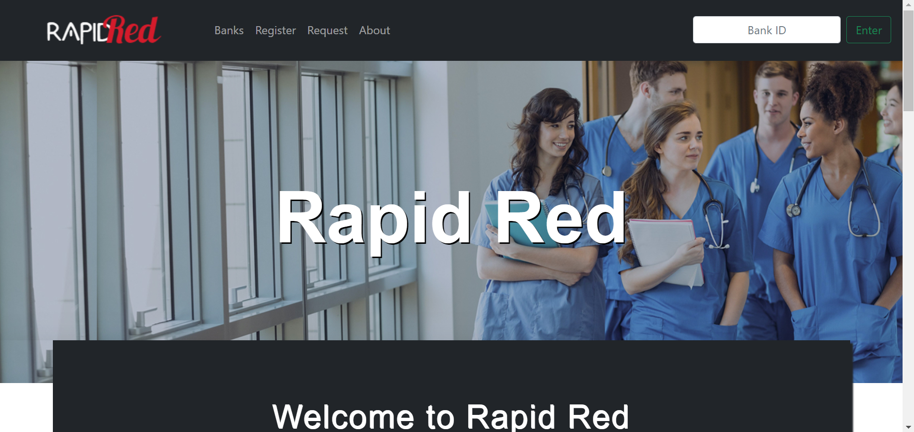
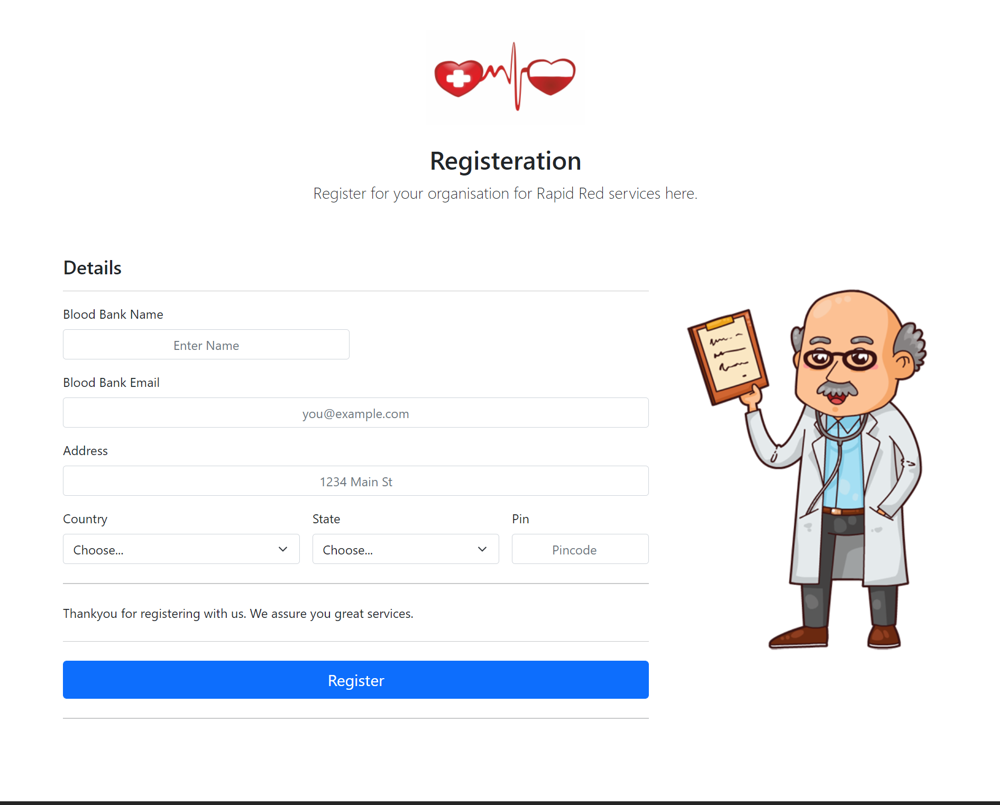

# T35-Imposter
Official Repository for DotSlash 4.0 Submission of Team 35: Imposter

# Rapid Red 
This is our official project for Dotslash 4.0 
Contributors: 
Sakshi Jain Himani Verma Riya Sharma
# Introduction:drop_of_blood::hospital:
This Web-App is Based on the Theme 'Rural Health Development'.  

  Considering people in the Rural Areas do not have much access to Internet facility and might also not have an E-mail ID so considering all these factors our Web-App provides the best for them. 
We have created a Simple Application which reduces complexity as much as possible so that people can make blood request when Urgent without any tedious operations. 
Considering People in Rural areas will not keep a track of verification from the Blood Bank once requested the Blood Bank will take people's Data from our Web-App and Contact them. It is just a platform to convey the message to the blood banks about the details of patient requiring blood.
Every Registerd Blood Bank will be provided with a Unique ID which they will use to Access all the Requests. This is done so that no leyman can access any patient's information.  

# How it works :thinking:?
## Registration Page For Blood Banks 
This is the registration form for Blood Banks providing their relevant information.  

  After registering on the site, a unique ID is generated for every Blood Bank and it can be used to search for that Blood Bank in the _Search Bar_ provided on the __HOME__ page.

